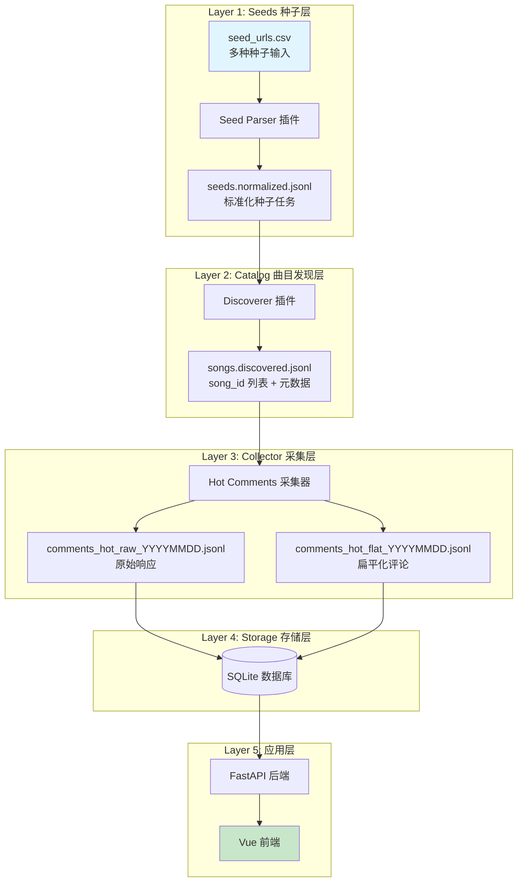

# NeteaseMusicCrawler 开发者文档（数据采集/存储/解析/部署）

> **目标**：构建一个**可复现、可增量、可部署**的数据管线，支持从网易云音乐多种种子（Playlist/Album/Rank）抓取歌曲热门评论，并提供完整的前后端展示。
>
> **核心理念**：插件化架构、调试友好、错误可追溯、部署简单。

---

## 1. 项目概述

NeteaseMusicCrawler 是一个分层数据管道系统，包含以下核心组件：

| 组件 | 功能 | 技术栈 |
|------|------|--------|
| **数据采集管道** | 从种子链接发现歌曲，抓取热门评论 | Python + requests + 插件系统 |
| **数据存储** | 原始数据（JSONL） + 结构化数据（SQLite） | SQLite + JSONL |
| **后端 API** | 提供数据查询与管理接口 | FastAPI + Uvicorn |
| **前端界面** | 数据展示与交互 | Vue 3 + Vite + Element Plus |
| **部署与监控** | 生产环境部署与运行监控 | Nginx + systemd + Prometheus |

**支持种子类型**（按优先级实现）：
1. **Playlist**（播放列表） - 优先实现
2. **Album**（专辑） - 后续扩展
3. **Rank**（用户歌曲排名） - 后续扩展

---

## 2. 核心原则（必须遵守）

1. **Append-only 原则**：原始 JSONL 文件只追加写入，不覆盖、不就地修改。
2. **每次运行都有 run_id**：任何输出记录都必须携带 `run_id`，用于审计、重跑、对比、增量。
3. **全局 trace_id**：每个请求链（seed→song→comment）都有唯一的 `trace_id`，便于调试与日志关联。
4. **单行可独立解析**：JSONL 的每一行都必须是完整 JSON 对象，不能依赖上下文。
5. **失败不阻塞**：单个 seed/song 失败要记录到 `failures.jsonl` / `crawl_failures`，不能让整批终止。
6. **幂等与去重**：重复运行不会导致数据膨胀（依赖唯一键/入库去重策略）。
7. **插件化扩展**：新的种子类型通过插件添加，无需修改核心代码。
8. **部署友好**：优先使用 `requests`（无浏览器），确保 Debian 12 上易运行。

---

## 3. 系统架构

### 3.1 分层架构（Layered Pipeline）



### 3.2 插件系统设计

系统采用插件化设计，支持动态扩展新的种子类型：

```python
# 抽象接口定义
class SeedParser(ABC):
    @abstractmethod
    def can_parse(self, url: str) -> bool: ...
    @abstractmethod
    def parse(self, url: str) -> SeedInfo: ...

class Discoverer(ABC):
    @abstractmethod
    def can_discover(self, seed_type: str) -> bool: ...
    @abstractmethod
    def discover(self, seed_id: str) -> List[SongInfo]: ...

# 插件注册机制
registry.register_parser(PlaylistParser())
registry.register_discoverer(PlaylistDiscoverer())
```

**插件目录结构**：
```
plugins/
├── playlist/
│   ├── parser.py
│   └── discoverer.py
├── album/
│   ├── parser.py
│   └── discoverer.py
└── rank/
    ├── parser.py
    └── discoverer.py
```

**配置启用插件**：
```yaml
plugins:
  enabled: ["playlist", "album"]  # 按需启用
```

---

## 4. 目录结构（建议）

在 `final-assignment/NeteaseMusicCrawler/` 下使用如下结构：

```
NeteaseMusicCrawler/
├── inputs/                          # 输入文件
│   ├── seed_urls.csv               # 种子链接输入
│   └── songs.csv                   # 可选：已生成的 song_id 清单
├── data/raw/                       # 原始数据（追加写入）
│   ├── seeds.normalized.jsonl      # 标准化种子
│   ├── songs.discovered.jsonl      # 发现的歌曲
│   ├── comments_hot_raw_YYYYMMDD.jsonl
│   └── failures_YYYYMMDD.jsonl     # 失败记录
├── data/processed/                 # 处理后的数据
│   ├── comments_hot_flat_YYYYMMDD.jsonl
│   └── comments.sqlite             # SQLite 数据库
├── logs/                           # 结构化日志
│   ├── pipeline_YYYYMMDD.log
│   └── errors_YYYYMMDD.log
├── plugins/                        # 插件目录
│   ├── playlist/
│   ├── album/
│   └── rank/
├── src/                            # 源代码
│   ├── crawler/                    # 爬虫核心
│   ├── api/                        # FastAPI 后端
│   └── frontend/                   # Vue 前端
├── config/                         # 配置文件
│   ├── development.yaml
│   └── production.yaml
├── scripts/                        # 工具脚本
│   ├── init_database.py
│   └── backup.sh
└── tests/                          # 测试
```

---

## 5. 输入规范

### 5.1 `inputs/seed_urls.csv`

用于定义“从哪里发现歌曲”。支持多种种子类型：

- **必选列**：
  - `seed_type`：枚举值 `playlist` / `album` / `rank`（根据 URL 自动识别，此列可省略）
  - `seed_url`：种子链接
- **可选列**：
  - `tag`：自定义分组标签（例如 `folk_2025`）

**示例**：
```csv
seed_url,tag
https://music.163.com/#/playlist?id=17585326784,test_playlist
https://music.163.com/#/album?id=177573237,test_album
https://music.163.com/#/user/songs/rank?id=1379862496,test_rank
```

### 5.2 `inputs/songs.csv`（可选）

当你不走种子发现逻辑、或需要固定 song 集合时使用。

- 必选列：`song_id`
- 可选列：`name,artist,group,source_seed`

**示例**：
```csv
song_id,name,artist,group
2747400519,Gameboi,新秀,hiphop
27759600,Five Hundred Miles,Justin Timberlake,folk
```

---

## 6. 数据协议（层间协议）

所有 JSONL 文件必须包含以下基础字段：
- `protocol_version`：协议版本（当前为 "1.0"）
- `trace_id`：全局追踪 ID（格式：`trc_` + 16位随机字符）
- `run_id`：运行 ID（格式：`run_` + ISO 8601 时间戳）
- `created_at`：记录创建时间（ISO 8601）

### 6.1 Layer 1 → Layer 2：`data/raw/seeds.normalized.jsonl`

每行一个种子解析结果：

**字段**：
```json
{
  "protocol_version": "1.0",
  "trace_id": "trc_abc123def456",
  "run_id": "run_20251223T180000Z",
  "seed_type": "playlist",
  "seed_id": "17585326784",
  "seed_url_raw": "https://music.163.com/#/playlist?id=17585326784",
  "seed_url_normalized": "https://music.163.com/api/playlist/detail?id=17585326784",
  "parse_status": "success",  // success / failed
  "error_message": null,
  "parsed_at": "2025-12-23T18:00:00Z"
}
```

### 6.2 Layer 2 输出：`data/raw/songs.discovered.jsonl`

每行一个歌曲（允许重复写入但建议去重）：

**字段**：
```json
{
  "protocol_version": "1.0",
  "trace_id": "trc_def456ghi789",
  "run_id": "run_20251223T180000Z",
  "song_id": "2747400519",
  "song_name": "Gameboi",
  "artist_name": "新秀",
  "album_id": "177573237",
  "album_name": "Gameboi",
  "source_seed_type": "playlist",
  "source_seed_id": "17585326784",
  "discover_time": "2025-12-23T18:01:02Z"
}
```

**唯一键建议**：`song_id`

### 6.3 Layer 3 输出（raw）：`data/raw/comments_hot_raw_YYYYMMDD.jsonl`

每行一次请求的原始记录：

**字段**：
```json
{
  "protocol_version": "1.0",
  "trace_id": "trc_ghi789jkl012",
  "run_id": "run_20251223T180000Z",
  "song_id": "2747400519",
  "request_time": "2025-12-23T18:02:10Z",
  "http_status": 200,
  "elapsed_ms": 312,
  "error_code": null,
  "payload_raw": {
    "hotComments": [...]
  }
}
```

### 6.4 Layer 3 输出（flat）：`data/processed/comments_hot_flat_YYYYMMDD.jsonl`

每行一条评论（用于入库/统计）：

**字段**：
```json
{
  "protocol_version": "1.0",
  "trace_id": "trc_jkl012mno345",
  "run_id": "run_20251223T180000Z",
  "song_id": "2747400519",
  "crawl_time": "2025-12-23T18:02:10Z",
  "source": "hot",
  "content": "你们不是听泰格西rapeter吗怎么开始转发非洲娃了",
  "liked_count": 791,
  "user_hash": "u_9f3a7b2c...",  // SHA256(userId + salt)
  "comment_id": null,  // 若可获得
  "raw_ref": "raw_20251223.jsonl:line_42",
  "data_quality": {
    "has_user_id": true,
    "has_nickname": true,
    "has_content": true,
    "has_liked_count": true
  }
}
```

**隐私保护**：
- `userId` → `user_hash`（SHA256(userId + salt)）
- `nickname` 不存储（隐私合规）

**唯一键建议**：
- 优先：`(song_id, comment_id)`（如果 comment_id 存在且稳定）
- 否则：`(song_id, content)`

---

## 7. 存储协议（SQLite 结构）

数据库文件：`data/processed/comments.sqlite`

### 7.1 表：`songs`
```sql
CREATE TABLE songs (
  song_id TEXT PRIMARY KEY,
  song_name TEXT,
  artist_name TEXT,
  album_id TEXT,
  album_name TEXT,
  first_seen_at TEXT,
  last_seen_at TEXT
);
```

### 7.2 表：`hot_comments`
```sql
CREATE TABLE hot_comments (
  id INTEGER PRIMARY KEY AUTOINCREMENT,
  song_id TEXT NOT NULL,
  crawl_time TEXT NOT NULL,
  content TEXT NOT NULL,
  liked_count INTEGER NOT NULL,
  user_hash TEXT,
  comment_id TEXT,
  trace_id TEXT,
  run_id TEXT,
  UNIQUE(song_id, comment_id) ON CONFLICT IGNORE,
  FOREIGN KEY (song_id) REFERENCES songs (song_id)
);
```

### 7.3 表：`seed_sources`（新增）
```sql
CREATE TABLE seed_sources (
  seed_id TEXT PRIMARY KEY,
  seed_type TEXT NOT NULL,
  title TEXT,
  description TEXT,
  cover_url TEXT,
  song_count INTEGER,
  discovered_at TEXT
);
```

### 7.4 表：`crawl_progress`（新增）
```sql
CREATE TABLE crawl_progress (
  song_id TEXT PRIMARY KEY,
  last_crawled_at TEXT,
  crawl_status TEXT,  -- success/failed/pending
  error_code TEXT,
  error_message TEXT,
  retry_count INTEGER DEFAULT 0,
  FOREIGN KEY (song_id) REFERENCES songs (song_id)
);
```

### 7.5 表：`crawl_failures`
```sql
CREATE TABLE crawl_failures (
  id INTEGER PRIMARY KEY AUTOINCREMENT,
  trace_id TEXT NOT NULL,
  stage TEXT NOT NULL,  -- seed_parse/discover/collect/store
  target_type TEXT NOT NULL,  -- seed/song/comment
  target_id TEXT NOT NULL,
  error_code TEXT NOT NULL,
  error_message TEXT,
  error_context JSON TEXT,
  created_at TEXT NOT NULL,
  resolved_at TEXT,
  resolution TEXT  -- retried/skipped/manual
);
```

### 7.6 表：`crawl_runs`
```sql
CREATE TABLE crawl_runs (
  run_id TEXT PRIMARY KEY,
  started_at TEXT,
  finished_at TEXT,
  n_seeds INTEGER,
  n_songs INTEGER,
  n_requests INTEGER,
  n_success INTEGER,
  n_fail INTEGER,
  duration_sec INTEGER
);
```

**索引建议**：
```sql
CREATE INDEX idx_hot_comments_song_id ON hot_comments(song_id);
CREATE INDEX idx_hot_comments_liked_count ON hot_comments(liked_count DESC);
CREATE INDEX idx_hot_comments_crawl_time ON hot_comments(crawl_time);
CREATE INDEX idx_songs_artist ON songs(artist_name);
CREATE INDEX idx_crawl_failures_trace_id ON crawl_failures(trace_id);
```

---

## 8. 错误处理与日志协议

### 8.1 错误分类（Error Taxonomy）

| 类别 | 错误码前缀 | 示例 | 处理策略 |
|------|------------|------|----------|
| **网络错误** | `NET_` | `NET_TIMEOUT`, `NET_CONN_REFUSED` | 指数退避重试（最多3次） |
| **API 错误** | `API_` | `API_429_RATE_LIMIT`, `API_404_NOT_FOUND` | 等待后重试或跳过 |
| **解析错误** | `PARSE_` | `PARSE_JSON_INVALID`, `PARSE_FIELD_MISSING` | 记录失败，继续下一项 |
| **数据错误** | `DATA_` | `DATA_VALIDATION_FAILED` | 记录警告，使用默认值 |
| **系统错误** | `SYS_` | `SYS_DISK_FULL`, `SYS_DB_CONN_FAILED` | 停止运行，报警 |

### 8.2 结构化日志格式

```json
{
  "timestamp": "2025-12-23T16:55:00Z",
  "level": "ERROR",
  "service": "crawler",
  "trace_id": "trc_abc123def456",
  "stage": "collect",
  "song_id": "2747400519",
  "error_code": "API_429_RATE_LIMIT",
  "message": "API rate limit exceeded",
  "context": {
    "url": "https://music.163.com/api/comment/hot",
    "retry_count": 2,
    "wait_seconds": 60
  },
  "resource_usage": {
    "memory_mb": 45.2,
    "cpu_percent": 12.5
  }
}
```

**日志级别**：DEBUG > INFO > WARNING > ERROR > CRITICAL

### 8.3 失败记录文件

`failures_YYYYMMDD.jsonl` 格式：
```json
{
  "protocol_version": "1.0",
  "trace_id": "trc_fail_999",
  "run_id": "run_20251223T180000Z",
  "stage": "collect",
  "target_type": "song",
  "target_id": "2747400519",
  "error_code": "API_429_RATE_LIMIT",
  "error_message": "API rate limit exceeded, please wait 60 seconds",
  "error_context": {
    "url": "https://music.163.com/weapi/v1/resource/comments/R_SO_4_2747400519",
    "attempt": 3,
    "wait_seconds": 60
  },
  "created_at": "2025-12-23T18:02:15Z"
}
```

---

## 9. 配置管理

### 9.1 配置文件（`config.yaml`）

```yaml
version: 1.0

# 部署模式
deployment:
  mode: "production"  # development/production
  data_dir: "./data"
  log_dir: "./logs"

# 插件配置
plugins:
  enabled:
    - playlist
    # - album    # 注释掉，后续启用
    # - rank     # 注释掉，后续启用
  plugin_dir: "./plugins"

# 爬虫配置
crawler:
  sleep_base: 0.8
  sleep_jitter: 0.7
  timeout_sec: 10
  retries: 3
  max_concurrent: 1
  batch_size: 50

# 数据库配置
database:
  path: "./data/processed/comments.sqlite"
  journal_mode: "WAL"
  busy_timeout: 5000

# 日志配置
logging:
  level: "INFO"  # DEBUG/INFO/WARNING/ERROR
  format: "json"  # json/text
  file: "logs/pipeline.log"
  max_size_mb: 100
  backup_count: 7

# API 配置
api:
  host: "0.0.0.0"
  port: 8000
  workers: 1
  cors_origins: ["http://localhost:5173", "https://your-domain.com"]

# 监控配置
monitoring:
  enable_metrics: true
  metrics_port: 9090
  health_check_interval: 30
```

### 9.2 环境变量覆盖

所有配置项都可以通过环境变量覆盖，格式：`NETEASE_<SECTION>_<KEY>`，例如：
- `NETEASE_CRAWLER_SLEEP_BASE=1.0`
- `NETEASE_DATABASE_PATH=/var/lib/netease/comments.sqlite`

---

## 10. 运行策略与监控

### 10.1 抓取频率与增量

- **初期推荐**：每天全量抓一次（1000 次请求/天，成本可控）
- **后期优化**：
  - 跳过 24h 内已抓过的 song
  - 对失败列表优先补抓
  - 增量更新：只抓取新增歌曲

### 10.2 限速与重试策略

```python
def crawl_with_retry(song_id, max_retries=3):
    for attempt in range(max_retries):
        try:
            response = request_api(song_id)
            return response
        except (Timeout, NetworkError) as e:
            sleep_time = base * (2 ** attempt) + random.uniform(0, jitter)
            sleep(sleep_time)
    log_failure(song_id, e)
```

### 10.3 健康检查

每个服务提供健康检查端点：

- **爬虫**：`http://localhost:8001/health`（返回最近抓取状态）
- **后端API**：`http://localhost:8000/health`（返回数据库连接状态、磁盘空间等）
- **前端**：`http://localhost:8080/`（静态文件服务）

**健康检查响应**：
```json
{
  "status": "healthy",
  "timestamp": "2025-12-23T18:00:00Z",
  "services": {
    "database": "connected",
    "disk_space": "85% free"
  }
}
```

### 10.4 监控指标（Prometheus）

爬虫暴露以下指标：
- `crawler_requests_total`（Counter）
- `crawler_errors_total`（Counter，带 error_code 标签）
- `crawler_duration_seconds`（Histogram）
- `crawler_songs_processed`（Gauge）

访问 `http://localhost:9090/metrics` 获取指标数据。

---

## 11. 部署指南（简化版）

### 11.1 快速部署到 VPS（Debian 12）

**前提**：
- 一台 Debian 12 VPS（1核1G内存足够）
- 一个域名（已在 Cloudflare 管理）
- SSH 访问权限

**步骤**：
1. **连接 VPS**：
   ```bash
   ssh root@你的VPS_IP地址
   ```

2. **运行一键部署脚本**：
   ```bash
   curl -fsSL https://raw.githubusercontent.com/你的仓库/deploy.sh | bash
   ```

3. **配置域名**（Cloudflare）：
   - 添加 A 记录：`api.yourdomain.com` → 你的 VPS IP
   - 开启代理（橙云图标）

4. **访问应用**：
   - 前端：`https://api.yourdomain.com`
   - API 文档：`https://api.yourdomain.com/docs`

### 11.2 详细部署脚本（`deploy.sh`）

完整脚本见附录或项目仓库的 `scripts/deploy.sh`。

### 11.3 systemd 服务文件

参考第 8 节中的服务文件配置。

### 11.4 Nginx 配置

参考第 8 节中的 Nginx 配置。

---

## 12. 开发路线图（TODO）

### 第一阶段：Playlist 优先实现
1. [ ] 实现 Playlist 种子解析器
2. [ ] 实现 Playlist 歌曲发现器
3. [ ] 实现热评采集器（基于现有代码改造）
4. [ ] 实现 SQLite 入库器
5. [ ] 编写端到端测试

### 第二阶段：后端 API
6. [ ] 实现 FastAPI 后端基础框架
7. [ ] 实现歌曲、评论查询接口
8. [ ] 实现管理接口（触发抓取、查看日志）
9. [ ] 实现健康检查与监控指标

### 第三阶段：前端界面
10. [ ] 搭建 Vue 3 项目
11. [ ] 实现歌曲列表页
12. [ ] 实现评论查看页
13. [ ] 实现管理面板

### 第四阶段：部署与监控
14. [ ] 编写一键部署脚本
15. [ ] 配置 systemd 服务
16. [ ] 配置 Nginx 反向代理
17. [ ] 添加监控与告警

### 第五阶段：扩展功能
18. [ ] 实现 Album 插件
19. [ ] 实现 Rank 插件
20. [ ] 添加数据分析与统计功能
21. [ ] 优化性能与资源占用

---

## 13. 常见问题与故障排除

### 13.1 爬虫相关
**Q：抓取速度太慢？**
A：调整 `sleep_base` 和 `sleep_jitter`，但注意不要触发风控。

**Q：API 返回 429 错误？**
A：系统已内置重试机制，会自动等待后重试。如持续出现，请增加 `sleep_base`。

**Q：如何查看抓取进度？**
A：查看 `logs/pipeline.log` 或查询 `crawl_progress` 表。

### 13.2 部署相关
**Q：Nginx 返回 502 Bad Gateway？**
A：检查后端 API 是否运行：`sudo systemctl status netease-api`

**Q：前端空白页面？**
A：检查静态文件路径是否正确，以及 Nginx 配置中的 `root` 目录。

**Q：数据库权限错误？**
A：确保 SQLite 文件及其目录对 `netease` 用户可写。

### 13.3 数据相关
**Q：重复数据如何处理？**
A：数据库表有唯一约束，重复数据会被自动忽略。

**Q：如何备份数据？**
A：使用 `scripts/backup.sh` 或直接复制 SQLite 文件和 JSONL 原始数据。

**Q：如何迁移到新服务器？**
A：复制整个 `data/` 目录和配置文件即可。

---

## 14. 版本历史

| 版本 | 日期 | 变更描述 |
|------|------|----------|
| v1.0 | 2025-12-23 | 初始版本，支持 album 类型 |
| v2.0 | 2025-12-24 | 完全重设计：插件化架构、trace_id 追踪、结构化日志、完整前后端设计 |

---

## 附录

### A. 快速测试命令

```bash
# 初始化数据库
python scripts/init_database.py

# 测试爬虫（使用 test.json 中的 playlist）
python -m crawler.main --config config/development.yaml --test

# 启动 API 服务
uvicorn api.main:app --reload --host 0.0.0.0 --port 8000

# 构建前端
cd frontend
npm run build
```

### B. 相关文件示例

- [`test.json`](final-assignment/NeteaseMusicCrawler/test.json)：三种种子类型的测试 URL
- [`hotcomments.csv`](final-assignment/NeteaseMusicCrawler/hotcomments.csv)：现有爬虫输出示例
- [`163MusicHotCommentsCrawler.py`](final-assignment/NeteaseMusicCrawler/163MusicHotCommentsCrawler.py)：现有爬虫代码参考

### C. 联系方式与支持

如有问题，请：
1. 查看日志文件 `logs/pipeline.log`
2. 检查数据库 `crawl_failures` 表
3. 参考在线文档（待部署）

---

**文档版本**：v2.0（2025-12-24）
**最后更新**：2025-12-23T17:07:00Z
