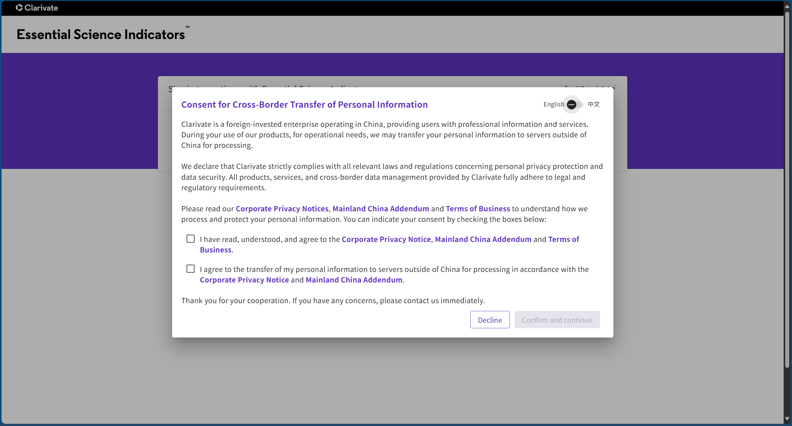
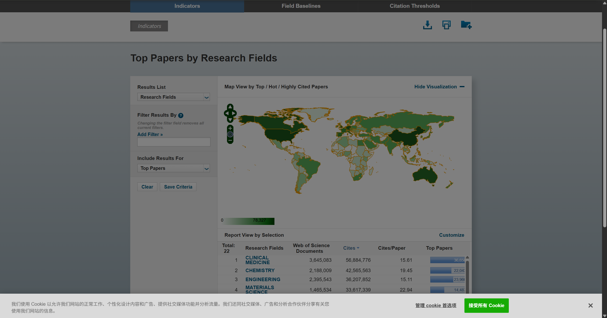

# Lab3 实验报告 - ESI学科数据获取及分析

## 1. 网站截图


(https://access.clarivate.com/login?app=esi)
  
(https://esi.clarivate.com/)  

## 2. 项目结构说明  


本项目结构如下：

### 根目录
- `ecnu_analysis.ipynb`：主数据分析与可视化 notebook。
- `README.md`：项目说明文档。

### crawler/ 目录
- `esi_clarivate_crawler.py`：经大模型优化版 ESI 数据爬虫脚本。
- `login.py`：初版 ESI 数据爬虫脚本，可读性差。
- `config.json`：爬虫配置文件（存放账号、密码、路径等参数）。 - ignore

### downloads/ 目录
- 存放所有学科领域的原始/转码 csv 数据文件。

### original/ 目录 - ignore
- 存放爬虫原始导出的 csv 文件备份。

### scripts/ 目录
- `transfer_to_utf-8.py`：数据转码为`UTF-8`脚本。
- `test_read_utf-8.py`, `ecnu_analysis.py`：转码后的测试脚本。
- `ecnu_analysis_results`：测试输出数据。
   
### chromedriver-win64/ 目录
- chromedriver 及相关依赖文件。

### images/ 目录
- 存放`README.md`的关联图片。 

## 3. 环境配置

### 1. chromedriver 下载
请根据你的 Chrome 浏览器版本，下载对应版本的 chromedriver，并放置于 `chromedriver-win64/` 文件夹下。
下载地址：https://chromedriver.chromium.org/downloads

### 2. Python 库安装
推荐使用 pip 安装依赖库：
```bash
pip install pandas numpy matplotlib seaborn selenium
```

### 3. config.json 配置文件说明
配置文件用于存储登录信息和路径参数，格式如下：
```json
{
  "email": "你的ESI账号",
  "password": "你的ESI密码",
  "download_dir": "homework_3\\downloads",
  "chromedriver_path": "homework_3\\chromedriver-win64\\chromedriver.exe",
  "login_url": "https://esi.clarivate.com/"
}
```  
请根据实际情况填写账号、密码和路径。  

## 实验步骤  

1. 运行`esi_clarivate_crawler.py`将爬取的csv数据，存放在downloads文件夹  
2. 运行`transfer_to_utf-8.py`将数据转码为`UTF-8`格式，可运行`test_read_utf-8.py`检查转码是否正确。  
3. 运行`ecnu_analysis.ipynb`进行数据分析。  

## 实验收获   

#### 1. 定位二级菜单时多用`ctrl + F`检查路径是否唯一  

```python  
''' 定位add filter二级菜单 '''  
# CSS_SELECTOR 定位方式  
researchFields = wait.until(EC.element_to_be_clickable((By.CSS_SELECTOR, "#popup .inner-popup-link#researchFields")))  
# 完整Xpath定位方式  
researchFields = wait.until(EC.element_to_be_clickable((By.XPATH, "/html/body/div[1]/div[2]/div[7]/div/ul/li[2]/a")))  
# 相对Xpath定位方式  
researchFields = wait.until(EC.element_to_be_clickable((By.XPATH, "//div[@id='popup']//a[@id='researchFields']")))  
researchFields.click()  
```   

#### 2.通过设置网站缩放规避二级菜单过长鼠标无法选中的问题
```python
driver.execute_script("document.body.style.zoom='80%';")
```

#### 3.`pandas`库的csv编码问题    

网站下载的csv文件默认是`ANSI`格式或者是`UTF-8`编码，但是`pandas`库 `read_csv()`目前看只能`utf-8`读取。  
```python
def convert_to_utf8(src_folder):
    for fname in os.listdir(src_folder):
        if fname.endswith('.csv'):
            fpath = os.path.join(src_folder, fname)
            with open(fpath, 'rb') as f:
                raw = f.read()
                result = chardet.detect(raw)
                encoding = result['encoding']
            try:
                content = raw.decode(encoding)
            except Exception as e:
                print(f"{fname} 编码检测为{encoding}但解码失败: {e}")
                continue
            with open(fpath, 'w', encoding='utf-8') as f:
                f.write(content)
            print(f"{fname} 已转换为UTF-8编码")
```


