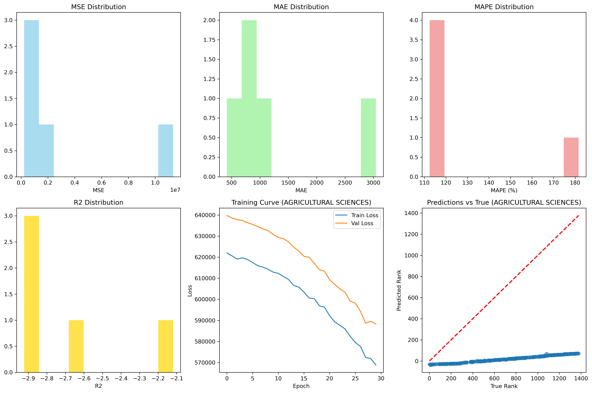
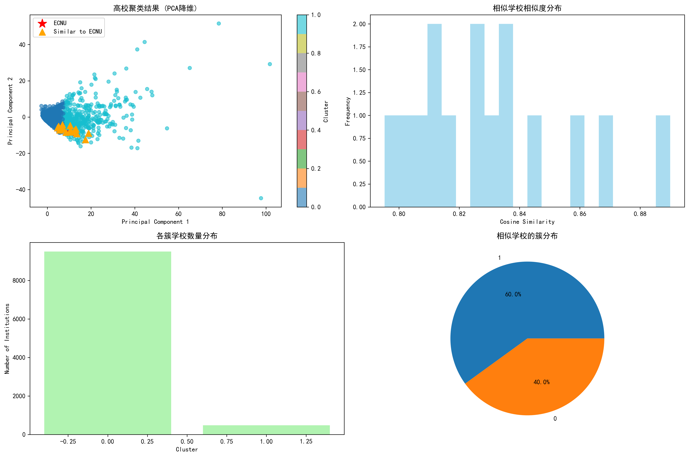

## 我做了什么（任务清单）

- 任务 11：利用深度学习方法，对各学科做排名预测模型；用 MSE、MAPE 等指标评价好坏。
- 任务 12：对 ESI 数据进行聚类，找出与华东师范大学（ECNU）相似的学校，并尝试分析原因/特征差异。

数据与工具：沿用前序作业的 ESI 表（MySQL）；核心代码在 `deep_learning_ranking.py`、`clustering_analysis.py`，通用预处理在 `utils.py`。

---

## 任务 11：深度学习排名预测（按学科）

### 我的核心思路（从“能跑通”开始）
1. 先把每条“学校×学科”的记录做成带有若干关键指标的样本：
   - 数值特征：`log_documents`、`log_cites`、`cites_per_paper`、`tp_rate`
   - 类别特征：`country_region`
2. 目标变量：用 `subject_rank`（若缺则从 `rank_percentile` 推出“伪排名”）。
3. 按学科拆分数据，每个学科独立训练一个回归模型（不同学科的分布差异挺大）。
4. 先上一个“朴素但能用”的 MLP，再用指标综合评价；后续再考虑早停/调参/融合。

### 模型（PyTorch MLP）
- 数值支路：Linear(4→64) + ReLU + BatchNorm + Dropout(0.2)；
- 类别支路：对 `country_region` 做类别编码并 Embedding(维度=8)；
- 拼接后接两层隐藏层（见 `RankingPredictor`）；
- 输出层：1 维回归输出（预测排名）。
- 损失函数：MSE；优化器：Adam(lr=1e-3)；小批量训练（batch_size=32）。

“为什么这么配”：
- ReLU + BatchNorm + Dropout：稳住训练、避免过拟合；
- Embedding：让国家/地区变成可学习的稠密向量；
- 结构不复杂，先保证稳定收敛和可复现，再去做更花的（比如学习率调度、早停、超参搜索）。

### 训练与评估
- 训练轮次：默认 30（为了先把流程打通）；
- 评估指标：
  - MSE（均方误差）与 RMSE（均方根误差）；
  - MAE（平均绝对误差）；
  - MAPE（平均绝对百分比误差）；
  - R²（决定系数）。

公式：
- MSE:  $\mathrm{MSE} = \frac{1}{n} \sum_i (\hat{y}_i - y_i)^2$
- MAPE: $\mathrm{MAPE} = \frac{100\%}{n} \sum_i \left|\frac{\hat{y}_i - y_i}{y_i}\right|$（注意 y 不能为 0）

### 产出与示例图
- 评估表：`results/deep_learning_scores.csv`
- 训练曲线/指标分布等图：

### 训练细节与超参数（弥补报告“怎么复现”的空白）
- 优化器：Adam(lr=1e-3)；损失：MSE；批大小：32；轮次：30（演示用）。
- 随机性控制：当前脚本未统一设置随机种子（会影响严格复现）。建议补充：固定 Python/NumPy/Torch 随机种子，并设置 `torch.backends.cudnn.deterministic=True`、`benchmark=False`。

### 评估协议（明确“怎么切分”的标准）
- 划分维度：按学科独立建模，学科内再切分 train/val/test（参见 `utils.per_subject_split`）。
- 统一指标：对各学科分别评估 MSE/MAE/MAPE/R²，再汇总到 CSV 表（而非只看单一学科）。
- 注意事项：MAPE 对接近 0 的 y 值不稳定，当前实现已做零值掩码/平滑，报告中需明确这一点（已在本文说明）。

---

## 任务 12：聚类与相似高校

### 我的核心思路
1. 目标是从“学校×学科”的维度，做成“学校”的向量画像，再聚类；
2. 我选了三类学科内可比的指标：
   - 排名表现：rank_percentile（缺失补齐为末位）；
   - 被引质量：`cites_per_paper` 的学科内 z-score；
   - 顶尖产出：top_papers 在学科内的相对比例（归一到 0~1）。
3. 把它们 pivot 成“行=学校、列=多学科特征”，整体标准化；
4. 用 KMeans 聚类，k 用轮廓系数+肘部法参考；
5. 再用余弦相似度，找出最接近 ECNU 的高校。

### 产出与示例图
- 聚类标签：`results/institution_clusters_dl.csv`
- 相似高校列表：`results/similar_schools_dl.csv`
- 可视化图（PCA 降维 + 分布图）：

### 簇画像与相似原因（补充“解释性”）
- 每簇画像：建议输出每个簇在三类特征（rank、cpp_z、tpr）上的均值表与热力图，描述该簇的学科优势格局。
- 相似原因：在 `similar_schools_dl.csv` 的基础上，增加与 ECNU 的“特征差异最小 TOP 列表”（具体到学科/指标），让“为什么相似”更直观。
- 稳健性：在不同随机种子/不同 k 附近（k±1）对比聚类一致性，避免参数偶然性导致的结论漂移。

---

## 结合代码解释

### 先讲大图景：本题依托的基础知识（宏观不纠结细节）

- 监督学习（回归）是什么：
  - 把输入特征 X（学校/学科的一组数值与类别信息）映射到连续目标 y（学科排名或其代理）。
  - 训练的目标是让模型 $f(X; θ)$ 的预测值尽量接近真实值 y。
- 损失与优化：
  - 用 MSE 衡量“平均平方误差”，大误差被更重惩罚；MAPE 关注“相对误差”，便于不同量级可比。
  - 用随机梯度下降类优化器（Adam）最小化损失，参数 θ 逐步更新。
- 模型与表示能力：
  - 多层感知机（MLP）通过非线性激活（ReLU）叠加，具备逼近复杂非线性关系的能力。
  - 类别特征用 Embedding 学成稠密向量，不再是稀疏/高维的 one-hot。
- 泛化与正则化：
  - BatchNorm 稳定分布、加速收敛；Dropout 随机丢弃减少过拟合；早停/学习率调度提升稳定与效率。
  - 训练/验证/测试的切分避免“记住答案”（数据泄漏），更接近真实泛化能力。
- 特征工程与尺度：
  - 标准化能让不同量纲的特征处于相近尺度，优化更稳定；对数变换能缓解长尾分布偏态。
- 评价指标怎么理解：
  - MSE/RMSE：看“误差大小”，RMSE更直觉（单位与目标一致）。
  - MAE：对离群点更稳健；MAPE：看相对误差，但对 y≈0 敏感需保护。
  - R²：解释方差比例，越接近 1 越好。
- 无监督学习（聚类）与相似度：
  - KMeans 假设簇“近似球形”，最小化簇内平方和；标准化很关键（否则大尺度特征主导）。
  - 轮廓系数评估簇内紧密与簇间分离；肘部法看随 k 的惯性下降趋势。
  - 余弦相似度衡量向量“方向”接近，适合高维画像比较；PCA 仅用于可视化降维，并不参与训练。
  - 矩阵“学校×学科特征”就是把每所学校变成一个高维向量，便于聚类与近邻检索。

### 任务 11：深度学习排名预测（代码路径 `deep_learning_ranking.py` + `utils.py`）

1) 读数据（`utils.py/load_esi_dataframe()`）
   - 从 MySQL 读取 `esi_data` 表。需要`homework_6/config.json`。

2) 清洗与衍生（`utils.py/clean_and_enrich(df)`）
   - 去重、整理文本列（institution/country_region/filter_value）。
   - 关键：按学科 `filter_value` 计算 `max_rank`，再得到 `rank_percentile`（0~1，小优）。
   - 复查点：确保 `subject_rank`、`filter_value` 这类关键列不是全空。
   - 为什么：对数变换让“极端大”更温和；比率强调相对位置。

3) 特征工程（`utils.py/make_subject_features(d)`）
    - 数值特征：`log_documents`、`log_cites`（对数变换消偏态），`cites_per_paper`，`tp_rate`（学科内归一）。
    - 目标变量：`y`（=subject_rank，数值越小越好）。
    - 为什么：对数变换让“极端大”更温和；比率强调相对位置。

4) 按学科切分（`utils.py/per_subject_split(d, random_state=42)`）
   - 返回：一个 dict，key 是学科（filter_value），value 里有 train/val/test 三份 DataFrame。
   - 小坑：样本太少的学科会被跳过。

5) 组装 PyTorch 数据集（`utils.py/class：ESIDataset`）
- 输入：数值特征列表 `['log_documents','log_cites','cites_per_paper','tp_rate']`，类别特征 `['country_region']`。
- 做了什么：数值标准化；类别转 codes；返回张量三元组。
    - 对数值特征做 `StandardScaler()` 标准化。
    - 类别特征做 `astype('category').cat.codes` 编码，便于后续 Embedding。
- 拿到：`__getitem__` 返回 `(numerical_tensor, categorical_tensor, target_tensor)`。
- 为什么：标准化让梯度尺度合适；codes 让 Embedding 可学。防止训练震荡或梯度爆炸/消失。

1) 定义网络（deep_learning_ranking.py）
- 类：`RankingPredictor`
- 结构：
  - 数值支路：`Linear(4→64)+ReLU+BatchNorm1d+Dropout(0.2)`。
  - 类别支路：`Embedding(≈1000, 8)`（每个类别特征一个 Embedding）。
  - 融合后接若干 `Linear+ReLU+BN+Dropout`，最后 `Linear(→1)` 输出预测排名。
- 初学者理解：数值特征走一条“感知器”路，类别特征先变稠密向量，再拼在一起学。

2) 训练（deep_learning_ranking.py）
- 函数：`train_model_for_subject_dl(train_data, val_data, num_epochs=30)`
- 关键：
  - 损失：`nn.MSELoss()`；优化器：`Adam(lr=1e-3)`；batch=32。
  - 循环：train → 验证 val_loss，记录损失曲线。
- 建议改进：加 EarlyStopping/ReduceLROnPlateau（我已在报告里写了如何补）。

3) 评估与可视化（deep_learning_ranking.py + utils.py）
- 函数：
  - `evaluate_model_dl(model, test_data)` 产出预测与真值。
  - `utils.evaluate_predictions(y_true, y_pred)` 计算 MSE/RMSE/MAE/MAPE/R²。
- 输出：
  - `results/deep_learning_scores.csv`（各学科指标汇总）。
  - `results/deep_learning_results.png`（指标分布、训练曲线、预测 vs 真实散点）。
- 解读：点越贴近对角线越好；MAPE 过大要检查 y 接近 0 的样本。

4) 快速定位常见报错
- CUDA 可用性：脚本会打印提示，不影响 CPU 训练。
- 某学科样本过少：脚本会跳过，属于正常现象。

### 任务 12：聚类与相似高校（代码路径 `clustering_analysis.py` + `utils.py`）

1) 读数据和清洗（同任务 11）
- `load_esi_dataframe()` → `clean_and_enrich()`。

2) 构建高校特征矩阵（clustering_analysis.py）
- 函数：`build_institution_features(df_clean)`
- 三块特征（都做成“行=高校、列=学科”的宽表）：
  - rank：按学科取 `rank_percentile`（缺失填 1.0，代表靠后）。
  - cppz：`cites_per_paper` 的学科内 z-score（均值 0、方差 1，缺失填 0）。
  - tpr：`top_papers` 相对学科内最大值的比例（0~1）。
- 合并后整体 `StandardScaler()` 标准化，得到 `feature_matrix`。

3) 选聚类数量 k（clustering_analysis.py）
- 函数：`find_optimal_clusters(X, max_k=15)`
- 指标：轮廓系数（越大越好）、inertia（肘部法）。选一个兼顾分离度与稳定性的 k。

4) 聚类（clustering_analysis.py）
- 函数：`perform_clustering(feature_matrix, n_clusters=optimal_k)`
- 输出：`clustering_results`（高校→簇编号）。
- 导出：`results/institution_clusters_dl.csv`。

5) 找相似高校（clustering_analysis.py）
- 函数：`find_similar_institutions(target_institution, feature_matrix, clustering_results, n_similar=10)`
- 做法：余弦相似度，排除自己，取前 N 个。
- 目标名：默认用 `EAST CHINA NORMAL UNIVERSITY`，也可以换成中文或别名后运行。
- 导出：`results/similar_schools_dl.csv`。

6) 分析簇特征（clustering_analysis.py）
- 函数：`analyze_cluster_characteristics(...)` → 返回每簇的典型国家、簇大小等统计。
- 建议：把每簇在 rank/cppz/tpr 上的均值也导出成表格，做成热力图，方便“画像”。

7) 可视化（clustering_analysis.py）
- 函数：`visualize_clustering_results(...)`
- 做了：PCA 两维散点、相似度直方图、簇大小分布、相似学校的簇分布。
- 导出：`results/clustering_analysis.png`。

8) 常见问题
- 找不到 ECNU：把 `target_institution` 改成数据里实际的全称（中文/英文均可）。
- 中文乱码：`matplotlib` 字体设置已在脚本里处理，如仍有问题请安装中文字体或按 `selflrn/fix_matplotlib_font` 指南调整。

